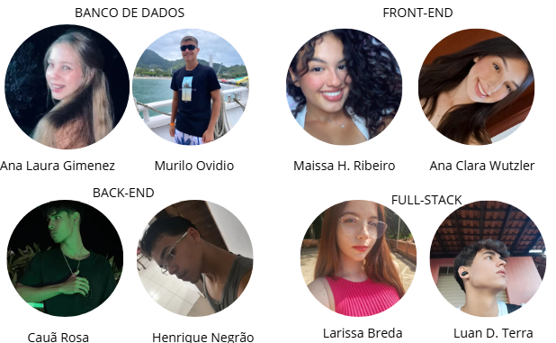

O projeto SafeZone é uma solução inovadora que utiliza tecnologia de ponta para monitorar e prever desastres naturais em áreas de risco.🌳🌩️.

## Problema
O Brasil, rico em biodiversidade, enfrenta sérios desafios ambientais como desmatamento, poluição, mudanças climáticas e má gestão de resíduos.  Esses problemas comprometem não só o meio ambiente, mas também a segurança da população. Diante disso, soluções como o Sistema de Gerenciamento de Riscos de Desastres são fundamentais para monitorar, prever e prevenir danos em áreas de risco.

## Objetivo do projeto
 O SafeZone é um sistema inteligente que usa sensores IoT para monitorar e prever desastres naturais, como enchentes e deslizamentos. Ele envia alertas em tempo real à população em risco, oferece mapas e rotas de evacuação em uma plataforma web, e apoia autoridades com dados e relatórios estratégicos. Seu foco é salvar vidas e reduzir os impactos de eventos extremos.

## ÍNDICE
- <a href="#funcionalidadeprojeto">Funcionalidades do projeto</a>
- <a href="#tecnologia">Tecnologias utilizadas</a>
- <a href="#autores">Autores</a>
- <a href="#contato">Contato</a>

## Funcionalidades do projeto 📲💻
- 📡 Monitoramento ambiental em tempo real via sensores IoT
- 📍 Visualização de áreas de risco em mapas interativos
- ⚠️ Emissão de alertas para a população e autoridades
- 📊 Geração de relatórios estratégicos

## Tecnologias utilizadas🧩🛠️

1. Front-End:  HTML, CSS, JavaScript;
2. Back-End: PHP;
3. Banco de Dados: MYSQL e Xampp para armazenar dados dos sensores e dos usuários;
4. Integração IoT: APIs para conectar os sensores ao sistema de monitoramento.

## Autores🧑‍🦰👩‍🦰

## Contato📲

- email: safezone@gmail.com
- telefone: (19)99999-9999
